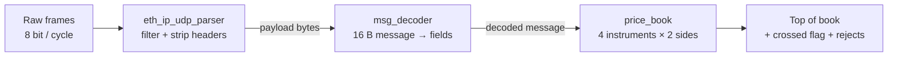

# Low-Latency Market Data Handler (SystemVerilog)

An FPGA pipeline that turns raw Ethernet market-data packets into a live
**top of book** (best bid / best ask) for multiple instruments, with a
deterministic latency of **3 clock cycles (12 ns @ 250 MHz)** from the last
message byte to the updated price.

Fully verified in simulation with **cocotb** against a Python reference model:
tens of thousands of randomised messages, directed corner cases, and
mutation testing of the testbench itself.

## Architecture



| Stage | Module | Latency | What it does |
|---|---|---|---|
| 1 | `eth_ip_udp_parser` | 1 cycle | Checks EtherType, IPv4 header, UDP protocol and port; streams out only the UDP payload (cut-through, no buffering); ignores Ethernet padding using the UDP length |
| 2 | `msg_decoder` | 1 cycle | Assembles 16-byte messages with a shift register and slices out side, instrument, price, quantity, sequence number; drops malformed and truncated messages |
| 3 | `price_book` | 1 cycle | Price-indexed order book per instrument and side; priority encoders find best bid / ask; reports changes, crossed books and rejected messages |

## Results

| Metric | Value |
|---|---|
| Latency (last message byte in → top of book out) | **3 cycles = 12 ns @ 250 MHz** |
| Order-book update | 1 cycle, independent of book depth |
| Instruments / price window | 4 instruments, 256 ticks each (parameters) |
| v2 book: random messages verified vs. reference model | 20,000 (4,457 top-of-book changes, 741 crossed states, 4,524 rejects) |
| End-to-end: random frames verified | 1,000 frames (valid + invalid, 1–4 messages each) |
| Decoder: random messages verified | 1,254 |

## Design decisions

**Cut-through parsing.** Every header field that must be checked sits in
bytes 12–39, before the payload starts at byte 42. The parser therefore knows
whether a frame is valid before the first payload byte arrives, and streams the
payload straight through with no frame buffer: one register stage, no memory.

**Decoder: shift register + same-cycle assembly.** The first 15 bytes of a
message are shifted into a 120-bit register; the 16th byte is concatenated
combinationally, so the full message is available in the cycle its last byte
arrives. Field extraction is pure wiring (bit slices) and costs no logic.

**Order book: from v1 to v2.**

- **v1 (`order_book.sv`, `book_side.sv`)**: 8 sorted price levels per side in
  registers. All 8 levels are compared with the new price in parallel; each
  entry is a small mux (keep / take neighbour / load new), so insert, update
  and remove all take one cycle. *Limitation:* when the book is full, the worst
  level is pushed out and lost forever; single instrument.
- **v2 (`price_book.sv`)**: every price tick in a per-instrument window has its
  own slot: a bitmap marks occupied ticks and a memory holds quantities.
  Updates are direct-indexed (no search, no shifting) and a priority encoder
  finds the highest bid / lowest ask in the same cycle, so **depth is unlimited
  and no level is ever lost**. A write-to-read bypass forwards the new quantity
  when the best level is the one being written. Adds multi-instrument support,
  crossed/locked-book detection and explicit reject reasons.
  *Trade-off:* prices must fall inside a configured window.

## Verification

- **cocotb** (Python) testbenches for every module, plus an end-to-end test of
  the full pipeline.
- **Reference model** (`tb/ref_model.py`): plain-Python order books; the RTL is
  compared against it after *every* message, including whether a top-of-book
  event should have been emitted.
- **Realistic stimulus**: bids below / asks above the mid price, cancels of
  live levels, occasional crossing orders, invalid frames, unknown instruments
  and out-of-window prices.
- **Mutation testing**: bugs were deliberately injected (wrong field slices,
  missing resets, wrong sort direction, removed bypass, off-by-one in the
  payload window) to confirm the tests catch them.
- **Latency is measured, not assumed**: the end-to-end test timestamps the last
  message byte and the `tob_valid` pulse.

## Run it

```bash
# Ubuntu / WSL2
sudo apt install -y iverilog gtkwave make python3-venv
python3 -m venv ~/venv && source ~/venv/bin/activate && pip install cocotb

cd tb
make TOP=market_data_handler    # end-to-end + latency
make TOP=price_book             # v2 order book
make TOP=order_book             # v1 order book
make TOP=msg_decoder
make TOP=eth_ip_udp_parser
make TOP=price_book WAVES=1     # dump waveforms to sim_build/<TOP>/
```

Tools: Icarus Verilog 12, cocotb 2.1, Python 3.12.

## Repository layout

```
rtl/   eth_ip_udp_parser.sv  msg_decoder.sv  price_book.sv
       market_data_handler.sv (top)   order_book.sv + book_side.sv (v1 book)
tb/    test_*.py (cocotb tests)  ref_model.py  packet_gen.py  Makefile
docs/  SPEC.md (interfaces, packet and message format, book semantics)
```

## Next steps

- 64-bit datapath at 156.25 MHz (10 GbE line rate)
- NASDAQ TotalView-ITCH 5.0 decoder, replaying real sample data
- Synthesis in Vivado: Fmax, resource usage, critical-path optimisation
  (e.g. hierarchical priority encoder, BRAM for quantities)
- Software (C++) baseline for a latency comparison
- Run on hardware (PYNQ board) with live Ethernet input
